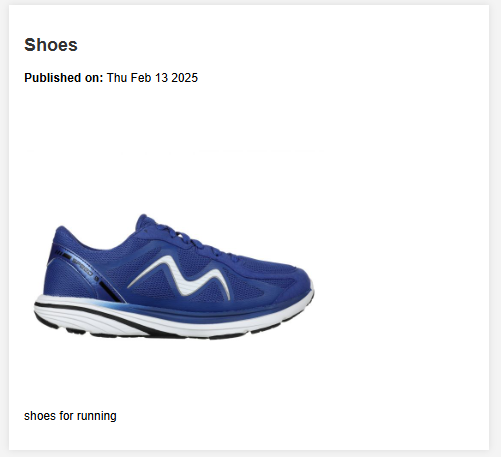

### **📌 Contentful Headless CMS Integration**  

This project integrates **Contentful**, a headless CMS, into a web application using **HTML, CSS, and JavaScript**. It dynamically fetches and displays content from Contentful using its API.

---

## **🚀 Features**  
✔️ Fetch dynamic content from Contentful  
✔️ Display text, images, and structured content  
✔️ Responsive UI with HTML, CSS, and JavaScript  
✔️ API integration with error handling  

---

## **📂 Project Structure**  

```
📦 contentful-web-app
│── 📄 index.html        # Main HTML file
│── 📄 styles.css        # CSS file for styling
│── 📄 script.js         # JavaScript for Contentful API integration
│── 📄 README.md         # Project documentation
```

---

## **🛠️ Setup & Installation**  


### **2️⃣ Open the Project**  
Simply open **index.html** in a browser.


```js
const client = contentful.createClient({
  const SPACE_ID = "oiizdl2hit49";
    const ACCESS_TOKEN = "d52UXnSpkBiPAzeHHSMwO2vHa9vxDIa7WYyN4GcskXg";
    const ENTRY_ID = "14xVKA4V20B5oxVvSAVCWc"
});
```

---

## **📡 Contentful API Integration**  
The app fetches content dynamically using Contentful's REST API.  
Example request in **JavaScript**:

```js
client.getEntry('14xVKA4V20B5oxVvSAVCWc')
  .then((entry) => console.log(entry))
  .catch(console.error);
```

---

## **📸 Screenshots**  
 

---

## **🧪 Testing the Integration**  
1. Open **Postman**.  
2. Send a **GET** request to:  
   ```
        https://cdn.contentful.com/spaces/${SPACE_ID}/environments/master/entries/${ENTRY_ID}?access_token=${ACCESS_TOKEN}
   ```
3. Ensure the response contains your Contentful data.  

---

## **🔧 Troubleshooting**  
| **Issue** | **Solution** |
|-----------|-------------|
| `401 Unauthorized` | Check your **access token** |
| `404 Not Found` | Verify **space ID & entry ID** |
| `403 Forbidden` | Ensure the API key is **Content Delivery API** |

---

